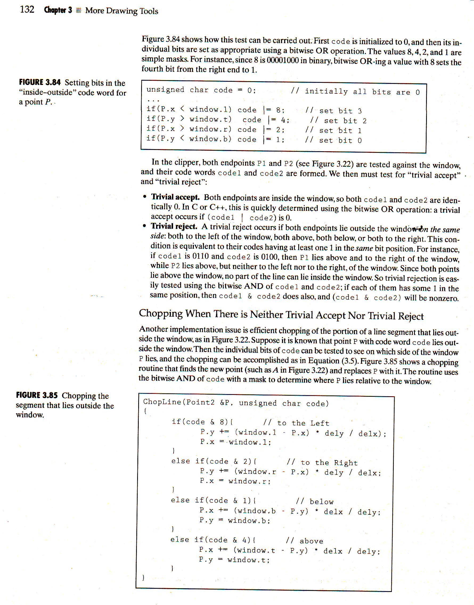

# Chopping

## Description



## Note

From this work, we starting to use google style. And we found a bug of astyle of formatting struct key-value initialization.

## Example

```Cpp
#ifndef MAIN_H_INCLUDED
#define MAIN_H_INCLUDED

#include <bits/stdc++.h>
#include <windows.h>
#include "GL/glut.h"

using namespace std;

struct Point {
  GLfloat x, y;
};

struct Window {
  GLfloat l, t, r, b;
};

void myDrawInit();
void myDisplay();


extern Window window;
unsigned char getInOutCode(Point &P, Window &window, unsigned char code);
void chopLine(Point &P, Window &window, unsigned char code, GLfloat delx, GLfloat dely);
int clipSegment(Point p1, Point p2, Window window);

#endif // MAIN_H_INCLUDED
```
```Cpp
#include "main.h"

struct BASE_CONFIG {
  float windows_w;
  float windows_h;
  string windows_title;
  float vp_x;
  float vp_y;
  float vp_w;
  float vp_h;
  float point_size;
  float flt_max;
} config = {
  windows_w: 600.0f,
  windows_h: 600.0f,
windows_title: "hello world"
  ,
vp_x:
  -300.0f,
  vp_y:
    -300.0f,
    vp_w: 300.0f,
    vp_h: 300.0f,
    point_size: 1.0f,
    flt_max: 20.0f * 20.0f,
  };

void myMouseFunc(int button, int state, int x, int y) {
}

void myMotionFunc(int x, int y) {
}

void myKeyboardFunc(unsigned char key, int x, int y) {
  switch (key) {
  case 'q': {
    cout << "QUIT" << endl;
    exit(0);
  }
  default:
    break;
  }
}

void myDrawInit() {
}

void myInit() {
  glutInitDisplayMode(GLUT_DEPTH | GLUT_DOUBLE | GLUT_RGB); // 双缓冲
  glutInitWindowSize(config.windows_w, config.windows_h);
  glutCreateWindow(config.windows_title.c_str());
  glClearColor(1.0f, 1.0f, 1.0f, 0.0f);
  glColor3f(.0f, .0f, .0f); // black
  glPointSize(config.point_size);
  glMatrixMode(GL_PROJECTION); // 投影
  glLoadIdentity(); // 矩阵单位化
  gluOrtho2D(config.vp_x, config.vp_w, config.vp_y, config.vp_h);
  glutDisplayFunc(&myDisplay);
  glutMouseFunc(myMouseFunc);
  glutMotionFunc(myMotionFunc);
  glutKeyboardFunc(myKeyboardFunc);
  glEnable(GL_DEPTH_TEST); // 开启深度测试
  myDrawInit();
}

void myDisplay() {
  glClear(GL_COLOR_BUFFER_BIT | GL_DEPTH_BUFFER_BIT);
  glPushMatrix();
  {
    glBegin(GL_LINE_STRIP);
    glVertex2f(window.l, window.t);
    glVertex2f(window.r, window.t);
    glVertex2f(window.r, window.b);
    glVertex2f(window.l, window.b);
    glVertex2f(window.l, window.t);
    glEnd();

    std::default_random_engine e;
    std::uniform_real_distribution<float> u(-300,300);
    for (int i = 0; i < 15; i++) {
      Point p1 = {u(e), u(e)};
      Point p2 = {u(e), u(e)};
      clipSegment(p1, p2, window);
    }
  }
  glFlush();
  glPopMatrix();
  glutSwapBuffers();
}

void rectDisplay() {
  glClear(GL_COLOR_BUFFER_BIT);
  glRectf(-0.9f, -0.9f, 0.9f, 0.9f);
  glFlush();
}

int main(int argc, char** argv, char** envp) {
  glutInit(&argc, argv);

  myInit();

  glutMainLoop();

  return 0;
}
```
```Cpp
#include "main.h"

Window window = {
  -210.0f, 210.0f, 210.0f, -210.0f
  };

unsigned char getInOutCode(Point &P, Window &window, unsigned char code = 0) {
  code |= (P.x < window.l ? 8 : 0);
  code |= (P.y > window.t ? 4 : 0);
  code |= (P.x > window.r ? 2 : 0);
  code |= (P.y < window.b ? 1 : 0);
  cout << (int)code << endl;
  return code;
}

void chopLine(Point &P, Window &window, unsigned char code, GLfloat delx, GLfloat dely) {
  if (code & 8) { // to the left
    P.y += (window.l - P.x) * dely / delx;
    P.x = window.l;
  } else if (code & 2) { // to the right
    P.y += (window.r - P.x) * dely / delx;
    P.x = window.r;
  } else if (code & 1) { // to the bottom
    P.x += (window.b - P.y) * delx / dely;
    P.y = window.b;
  } else if (code & 4) { // to the top
    P.x += (window.t - P.y) * delx / dely;
    P.y = window.t;
  }
}

int clipSegment(Point p1, Point p2, Window window) {
  // 内红外黑
  do {
    unsigned char code1 = getInOutCode(p1, window);
    unsigned char code2 = getInOutCode(p2, window);
    GLfloat delx = p2.x - p1.x;
    GLfloat dely = p2.y - p1.y;
    if ((code1 | code2) == 0) {
      // p1 到 p2 画红线
      glBegin(GL_LINES);
      glColor3f(.93f, .0f, .0f);
      glVertex2f(p1.x, p1.y);
      glVertex2f(p2.x, p2.y);
      cout << p1.x << "\t" << p1.y << "\t" << p2.x << "\t" << p2.y << endl;
      glEnd();
      return 1; // 平凡接受
    }
    if ((code1 & code2) != 0) {
      // p1 到 p2 画黑线
      glBegin(GL_LINES);
      glColor3f(.0f, .0f, .0f);
      glVertex2f(p1.x, p1.y);
      glVertex2f(p2.x, p2.y);
      cout << p1.x << "\t" << p1.y << "\t" << p2.x << "\t" << p2.y << endl;
      glEnd();
      return 0; // 平凡拒绝
    }
    if (code1) {
      // 旧 p1 到新 p1 画黑线
      glBegin(GL_LINES);
      glColor3f(.0f, .0f, .0f);
      glVertex2f(p1.x, p1.y);
      chopLine(p1, window, code1, delx, dely);
      glVertex2f(p1.x, p1.y);
      glEnd();
    }
    if (code2) {
      // 旧 p1 到新 p1 画黑线
      glBegin(GL_LINES);
      glColor3f(.0f, .0f, .0f);
      glVertex2f(p2.x, p2.y);
      chopLine(p2, window, code2, delx, dely);
      glVertex2f(p2.x, p2.y);
      glEnd();
    }
  } while(true);
}
```
