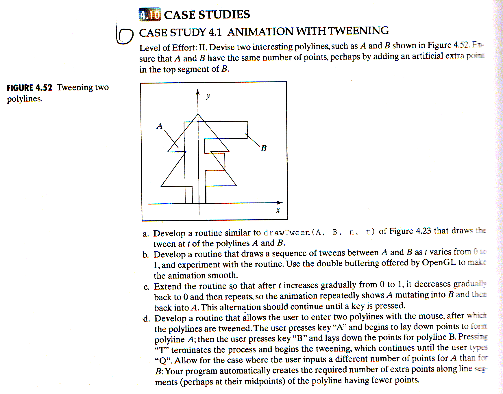

# Animation With Tweening

## Description



## Example

> main.h

```Cpp
#ifndef MAIN_H_INCLUDED
#define MAIN_H_INCLUDED

#include <bits/stdc++.h>
#include <windows.h>
#include "GL/glut.h"

struct Point {
  float x,y;
};

void myDisplay();
void myTimer(int);
void drawTween(std::vector<Point>&, std::vector<Point>&, int, float);

void setWorldWindow(double left, double right, double bottom, double top);
void setViewport(int left, int right, int bottom, int top);

#endif // MAIN_H_INCLUDED
```

> main.cpp

```Cpp
#include "main.h"

using namespace std;

struct BASE_CONFIG {
  float windows_w;
  float windows_h;
  string windows_title;
  double wp_t, wp_r, wp_b, wp_l;
  float vp_t, vp_r, vp_b, vp_l;
  float point_size;
  unsigned int gap;
  int frames;
} config = {
  windows_w: 600.0f,
  windows_h: 600.0f,
  windows_title: "hello world",
  wp_t: 300.0, wp_r: 300.0, wp_b: -300.0, wp_l: -300.0,
  vp_t: 300.0f, vp_r: 300.0f, vp_b: -300.0f, vp_l: -300.0f,
  point_size: 10.0f,
  gap: 10,
  frames: 80,
};

int global_frame = 0;
vector<Point> alpha,beta;

void myMouseFunc(int button, int state, int x, int y) {
}

void myMotionFunc(int x, int y) {
}

void myKeyboardFunc(unsigned char key, int x, int y) {
  switch (key) {
  case 'q': {
    cout << "QUIT" << endl;
    exit(0);
  }
  default:
    break;
  }
}

void myDateInit() {
  alpha.push_back(Point{-30, 0});
  alpha.push_back(Point{-30, 100});
  alpha.push_back(Point{-30, 200});
  alpha.push_back(Point{150, 200});
  alpha.push_back(Point{150, 170});
  alpha.push_back(Point{15, 170});
  alpha.push_back(Point{15, 150});
  alpha.push_back(Point{100, 150});
  alpha.push_back(Point{100, 120});
  alpha.push_back(Point{15, 120});
  alpha.push_back(Point{15, 0});

  beta.push_back(Point{-15, 0});
  beta.push_back(Point{-15, 50});
  beta.push_back(Point{-150, 50});
  beta.push_back(Point{-30, 130});
  beta.push_back(Point{-100, 130});
  beta.push_back(Point{0, 200});
  beta.push_back(Point{100, 130});
  beta.push_back(Point{30, 130});
  beta.push_back(Point{150, 50});
  beta.push_back(Point{15, 50});
  beta.push_back(Point{15, 0});
}

void myInit() {
  myDateInit();
  glutInitDisplayMode(GLUT_DEPTH | GLUT_DOUBLE | GLUT_RGB);
  glEnable(GL_DEPTH_TEST);
  glutInitWindowSize(config.windows_w, config.windows_h);
  glutCreateWindow(config.windows_title.c_str());
  glClearColor(1.0f, 1.0f, 1.0f, 0.0f);
  glColor3f(.0f, .0f, .0f); // black
  glPointSize(config.point_size);
  setWorldWindow(config.wp_l, config.wp_r, config.wp_b, config.wp_t);
  setViewport(config.vp_l, config.vp_r, config.vp_b, config.vp_t);
  glutDisplayFunc(&myDisplay);
  glutTimerFunc(config.gap, myTimer, 0);
  glutMouseFunc(myMouseFunc);
  glutMotionFunc(myMotionFunc);
  glutKeyboardFunc(myKeyboardFunc);
}

void myDisplay() {
  glClear(GL_COLOR_BUFFER_BIT | GL_DEPTH_BUFFER_BIT);
  glPushMatrix();
  {
    glBegin(GL_LINE_LOOP);
    float halfFrame = global_frame > config.frames / 2 ? config.frames - global_frame : global_frame;
    drawTween(alpha, beta, alpha.size(), (float)halfFrame / config.frames * 2);
    glEnd();
  }
  glFlush();
  glPopMatrix();
  glutSwapBuffers();
}

void myTimer(int frame) {
  global_frame = frame;
  glutPostRedisplay();
  glutTimerFunc(config.gap, myTimer, ++frame % config.frames);
}

void rectDisplay() {
  glClear(GL_COLOR_BUFFER_BIT);
  glRectf(-0.9f, -0.9f, 0.9f, 0.9f);
  glFlush();
}

void setWorldWindow(double left, double right, double bottom, double top) {
  glMatrixMode(GL_PROJECTION);
  glLoadIdentity();
  gluOrtho2D(left, right, bottom, top);
}

void setViewport(int left, int right, int bottom, int top) {
  glViewport(left, bottom, right-left, top-bottom);
}

int main(int argc, char** argv, char** envp) {
  glutInit(&argc, argv);

  myInit();

  glutMainLoop();

  return 0;
}
```

> 0x3.cpp

```Cpp
#include "main.h"

using namespace std;

float lerp(float a, float b, float t) {
  return a+(b-a)*t;
}
Point tween(Point a, Point b, float t) {
  return Point{lerp(a.x, b.x, t), lerp(a.y, b.y, t)};
}
void drawTween(vector<Point> &a, vector<Point> &b, int n, float t) {
  for (int i=0; i < n; i++) {
    Point p = tween(a[i], b[i], t);
    cout << p.x << ", " << p.y << ", " << t << endl;
    glVertex2f(p.x, p.y);
  }
}
```
