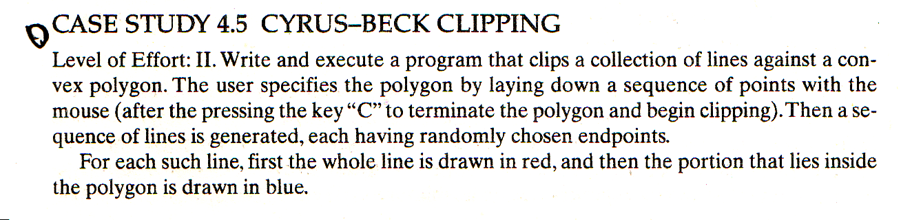

# Cyrus-Beck Clipping

## Description



## Example

> main.h

```Cpp
#ifndef MAIN_H_INCLUDED
#define MAIN_H_INCLUDED

#include <bits/stdc++.h>
#include <windows.h>
#include "GL/glut.h"

using namespace std;

struct Vector2 {
  double x, y;
  Vector2 operator*(double t) {
    return Vector2{x * t, y * t};
  }
};

struct Point {
  GLfloat x, y;
  Vector2 operator-(Point r) {
    return Vector2{r.x - x, r.y - y};
  }
};

struct Window {
  GLfloat l, t, r, b;
};

struct LineSegment {
  Point first, second;
  Vector2 toVector() {
    return Vector2{second.x - first.x, second.y - first.y};
  }
  Vector2 toNorm() {
    double dx = second.x - first.x;
    double dy = second.y - first.y;
    double s2 = dx * dx + dy * dy;;
    double s1 = sqrt(s2);
    return Vector2{-dy / s1, dx / s1};
  }
};

struct LineList {
  vector<LineSegment> line;
};

void myDrawInit();
void myDisplay();


extern Window window;
unsigned char getInOutCode(Point &P, Window &window, unsigned char code);
void chopLine(Point &P, Window &window, unsigned char code, GLfloat delx, GLfloat dely);
int clipSegment(Point p1, Point p2, Window window);
int cyrusBeckClip(LineSegment& seg, LineList& L);

class JarvisMarch {
  int n, m;
  vector<Point> ch, ps;
 private:
  int cross(const Point &o,const Point &a,const Point &b) { // 顺时针为正
    return -(a.x*b.y - a.x*o.y - o.x*b.y - a.y*b.x + a.y*o.x + o.y*b.x);
  }
  int length2(const Point &a,const Point &b) { // 距离的平方
    return a.x*a.x-2*a.x*b.x+b.x*b.x+a.y*a.y-2*a.y*b.y+b.y*b.y;
  }
  bool islb(const Point &a,const Point &b) { // a是否在b左下方
    return a.y<b.y||a.y==b.y&&a.x<b.x;
  }
  bool isfar(const Point &o,const Point &a,const Point &b) {
    return length2(a,o)>length2(b,o);
  }
  int jarvis_march() { // 求凸包到ch
    int start=0;
    for(int i=0; i<n; i++)
      if(islb(ps[i],ps[start]))
        start=i;
    int m=0; // 凸包定点数
    ch.push_back(ps[start]);
    for(m=1; 1; m++) {
      int next=start;
      for(int i=0; i<n; i++) {
        int c=cross(ch[m-1],ps[i],ps[next]);
        if(c>0 // 逆时针
            ||c==0&&isfar(ch[m-1],ps[i],ps[next]) // 同一直线但更远
          )
          next=i;
      }
      if(next==start)
        return m;
      ch.push_back(ps[next]);
    }
  }
 public:
  void solve(vector<Point> &nodeList) {
    n = nodeList.size();
    ps = nodeList;
    ch = vector<Point>();
    jarvis_march();
    nodeList = ch;
  }
};

#endif // MAIN_H_INCLUDED
```

> main.cpp

```Cpp
#include "main.h"

struct BASE_CONFIG {
  float windows_w;
  float windows_h;
  string windows_title;
  float vp_x;
  float vp_y;
  float vp_w;
  float vp_h;
  float point_size;
  float flt_max;
} config = {
  windows_w: 600.0f,
  windows_h: 600.0f,
  windows_title: "hello world",
  vp_x: -300.0f, vp_y: -300.0f, vp_w: 300.0f, vp_h: 300.0f,
  point_size: 3.0f,
  flt_max: 20.0f * 20.0f,
};

LineList lineList;
vector<LineSegment> randomLine, cutLine;
vector<Point> nodeList;
JarvisMarch *jmHelper = new JarvisMarch();

void myMouseFunc(int button, int state, int x, int y) {
  x -= config.vp_w;
  y = -y + config.vp_h;
  if (button == GLUT_LEFT_BUTTON && state == GLUT_UP) {
    cout << x << ", " << y << endl;
    nodeList.push_back(Point{x, y});
    jmHelper->solve(nodeList);
    glPushMatrix();
    glColor3f(.93f, .0f, .0f);
    glBegin(GL_POINTS);
    glVertex2i(x, y);
    glEnd();
    glFlush();
    glPopMatrix();
    glutSwapBuffers();
  }
}

void myMotionFunc(int x, int y) {
}

void myKeyboardFunc(unsigned char key, int x, int y) {
  switch (key) {
  case 'c': {
    cout << "create" << endl;
    nodeList.push_back(nodeList[0]);
    for(int i = 0; i < nodeList.size() - 1; i++) {
      Point v1 = nodeList[i], v2 = nodeList[i + 1];
      lineList.line.push_back(LineSegment{v1.x, v1.y, v2.x, v2.y});
    }
    nodeList.pop_back();
    myDisplay();
    break;
  }
  case 'q': {
    cout << "QUIT" << endl;
    exit(0);
  }
  default:
    break;
  }
}

void myDrawInit() {
}

void myInit() {
  glutInitDisplayMode(GLUT_DEPTH | GLUT_DOUBLE | GLUT_RGB); // 双缓冲
  glutInitWindowSize(config.windows_w, config.windows_h);
  glutCreateWindow(config.windows_title.c_str());
  glClearColor(1.0f, 1.0f, 1.0f, 0.0f);
  glColor3f(.0f, .0f, .0f); // black
  glPointSize(config.point_size);
  glMatrixMode(GL_PROJECTION); // 投影
  glLoadIdentity(); // 矩阵单位化
  gluOrtho2D(config.vp_x, config.vp_w, config.vp_y, config.vp_h);
  glutDisplayFunc(&myDisplay);
  glutMouseFunc(myMouseFunc);
  glutMotionFunc(myMotionFunc);
  glutKeyboardFunc(myKeyboardFunc);
  glEnable(GL_DEPTH_TEST); // 开启深度测试
}

void genRandomLines() {
  std::default_random_engine e;
  std::uniform_real_distribution<float> u(-300,300);
  for (int i = 0; i < 15; i++) {
    Point p1 = {u(e), u(e)};
    Point p2 = {u(e), u(e)};
    LineSegment seg;
    seg.first = p1;
    seg.second = p2;
    randomLine.push_back(seg);
    cutLine.push_back(seg);
  }
}

void myDisplay() {
  glClear(GL_COLOR_BUFFER_BIT | GL_DEPTH_BUFFER_BIT);
  glPushMatrix();
  {
    glColor3f(.93f, .0f, .0f);
    glBegin(GL_LINE_LOOP);
    for(auto i : nodeList) {
      glVertex2f(i.x, i.y);
    }
    glEnd();
    for (int i = 0; i < 15; i++) {
      LineSegment base = randomLine[i];
      LineSegment &seg = cutLine[i];
      Point p1 = seg.first, p2 = seg.second;
      int isCut = cyrusBeckClip(seg, lineList);


      if (isCut) {
        glColor3f(.93f, .0f, .0f);
        glBegin(GL_LINES);
        glVertex2f(seg.first.x, seg.first.y);
        glVertex2f(seg.second.x, seg.second.y);
        printf("%f %f %f %f -> %f %f %f %f\n", base.first.x, base.first.y, base.second.x, base.second.y,
               seg.first.x, seg.first.y, seg.second.x, seg.second.y);
        glEnd();
      }

      glColor3f(.0f, .0f, .0f);
      glBegin(GL_LINES);
      glVertex2f(base.first.x, base.first.y);
      glVertex2f(base.second.x, base.second.y);
      glEnd();
    }
  }
  glFlush();
  glPopMatrix();
  glutSwapBuffers();
}

int main(int argc, char** argv, char** envp) {
  genRandomLines();
  glutInit(&argc, argv);

  myInit();

  glutMainLoop();

  return 0;
}
```

> 0x4.cpp

```Cpp
#include "main.h"

Window window = {
  -210.0f, 210.0f, 210.0f, -210.0f
  };

double dot(Vector2 v1, Vector2 v2) {
  return v1.x * v2.x + v1.y * v2.y;
}

int chopCI(double& tIn, double& tOut, double number, double denom) {
  double tHit;
  if (denom < 0) {
    tHit = number / denom;
    cout << tHit << endl;
    if (tHit > tOut) {
      return 0;
    }
    if (tHit > tIn) {
      tIn = tHit;
    }
  } else if (denom > 0) {
    tHit = number / denom;
    cout << tHit << endl;
    if (tHit < tIn) {
      return 0;
    }
    if (tHit < tOut) {
      tOut = tHit;
    }
  } else if (number <= 0) {
    return 0;
  } else {
    return 1;
  }
}

int cyrusBeckClip(LineSegment& seg, LineList& L) {
  if (L.line.size() == 0) {
    return 0;
  }
  double number, denom;
  double tIn = 0.0, tOut = 1.0;
  Vector2 c, tmp;
  c = seg.toVector();
  for (int i = 0; i < L.line.size(); i++) {
    tmp =  seg.first - L.line[i].first;
    number = dot(L.line[i].toNorm(), tmp);
    denom = dot(L.line[i].toNorm(), c);
    if (!chopCI(tIn, tOut, number, denom)) {
      return 0;
    }
  }
  cout << tIn << ", " << tOut << endl;
  if (tOut < 1.0) {
    seg.second.x = seg.first.x + c.x * tOut;
    seg.second.y = seg.first.y + c.y * tOut;
  }
  if (tIn > 0.0) {
    seg.first.x = seg.first.x + c.x * tIn;
    seg.first.y = seg.first.y + c.y * tIn;
  }
  return 1;
}

unsigned char getInOutCode(Point &P, Window &window, unsigned char code = 0) {
  code |= (P.x < window.l ? 8 : 0);
  code |= (P.y > window.t ? 4 : 0);
  code |= (P.x > window.r ? 2 : 0);
  code |= (P.y < window.b ? 1 : 0);
  cout << (int)code << endl;
  return code;
}

void chopLine(Point &P, Window &window, unsigned char code, GLfloat delx, GLfloat dely) {
  if (code & 8) { // to the left
    P.y += (window.l - P.x) * dely / delx;
    P.x = window.l;
  } else if (code & 2) { // to the right
    P.y += (window.r - P.x) * dely / delx;
    P.x = window.r;
  } else if (code & 1) { // to the bottom
    P.x += (window.b - P.y) * delx / dely;
    P.y = window.b;
  } else if (code & 4) { // to the top
    P.x += (window.t - P.y) * delx / dely;
    P.y = window.t;
  }
}

int clipSegment(Point p1, Point p2, Window window) {
  do {
    unsigned char code1 = getInOutCode(p1, window);
    unsigned char code2 = getInOutCode(p2, window);
    GLfloat delx = p2.x - p1.x;
    GLfloat dely = p2.y - p1.y;
    if ((code1 | code2) == 0) {
      glBegin(GL_LINES);
      glColor3f(.93f, .0f, .0f);
      glVertex2f(p1.x, p1.y);
      glVertex2f(p2.x, p2.y);
      cout << p1.x << "\t" << p1.y << "\t" << p2.x << "\t" << p2.y << endl;
      glEnd();
      return 1;
    }
    if ((code1 & code2) != 0) {
      glBegin(GL_LINES);
      glColor3f(.0f, .0f, .0f);
      glVertex2f(p1.x, p1.y);
      glVertex2f(p2.x, p2.y);
      cout << p1.x << "\t" << p1.y << "\t" << p2.x << "\t" << p2.y << endl;
      glEnd();
      return 0;
    }
    if (code1) {
      glBegin(GL_LINES);
      glColor3f(.0f, .0f, .0f);
      glVertex2f(p1.x, p1.y);
      chopLine(p1, window, code1, delx, dely);
      glVertex2f(p1.x, p1.y);
      glEnd();
    }
    if (code2) {
      glBegin(GL_LINES);
      glColor3f(.0f, .0f, .0f);
      glVertex2f(p2.x, p2.y);
      chopLine(p2, window, code2, delx, dely);
      glVertex2f(p2.x, p2.y);
      glEnd();
    }
  } while(true);
}
```
