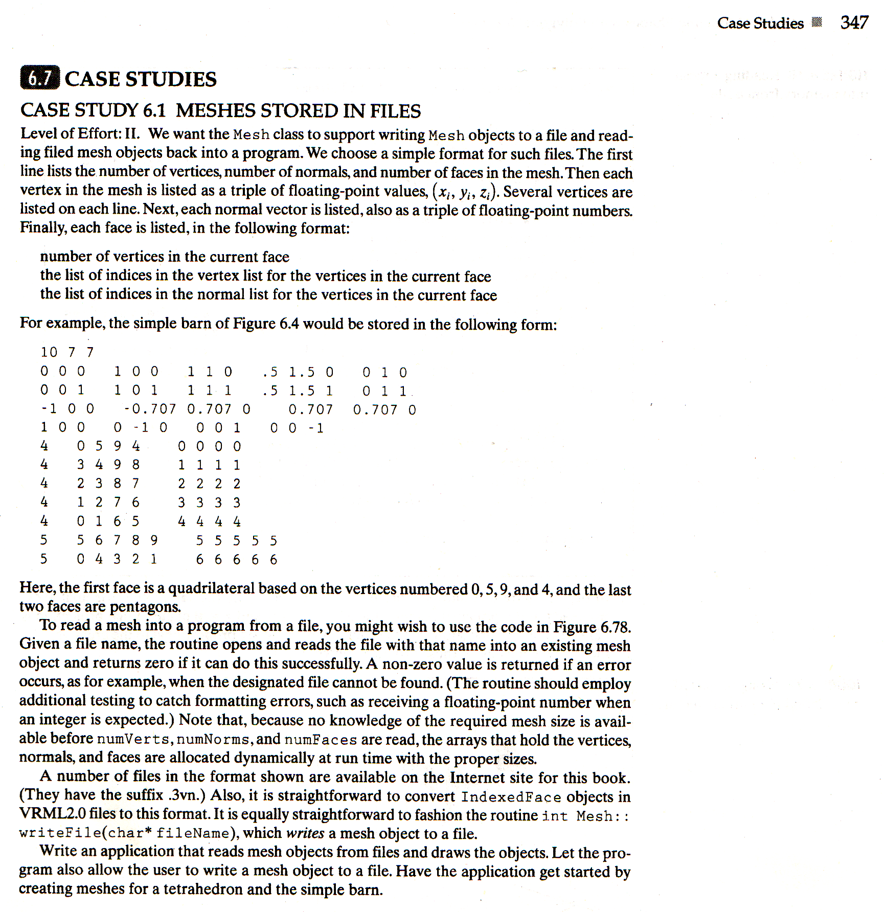

# Meshes Stored in Files

## Description



```
Polygonalize a sphere with some control arguments to specify the resolution. The result should be written to a file which can also be read for mesh display.
```

## Example

> main.h
```Cpp
#ifndef MAIN_H_INCLUDED
#define MAIN_H_INCLUDED

#include <bits/stdc++.h>
#include <windows.h>
#include "GL/glut.h"
#include "mesh.hpp"

struct Point {
  float x,y;
};

void myDisplay();
void myTimer(int);
void setWorldWindow(double left, double right, double bottom, double top, double near, double far);
void setViewport(int left, int right, int bottom, int top);
Mesh makeSphereMesh(int nSlices, int nStacks);

#endif // MAIN_H_INCLUDED
```
> main.cpp
```Cpp
#include "main.h"

using namespace std;

struct BASE_CONFIG {
  float windows_w, windows_h;
  string windows_title;
  double wp_t, wp_r, wp_b, wp_l, wp_near, wp_far;
  float vp_t, vp_r, vp_b, vp_l;
  float point_size;
  unsigned int gap;
  int frames;
} config = {
  windows_w: 600.0f, windows_h: 600.0f,
  windows_title: "hello world",
  wp_t: 3.0, wp_r: 3.0, wp_b: -3.0, wp_l: -3.0, wp_near: -4, wp_far: 8.0,
  vp_t: 3.0f, vp_r: 3.0f, vp_b: -3.0f, vp_l: -3.0f,
  point_size: 10.0f,
  gap: 10,
  frames: 80,
};

int global_frame = 0;
vector<Point> alpha,beta;
Mesh mesh("mesh.txt");

void myMouseFunc(int button, int state, int x, int y) {
}

void myMotionFunc(int x, int y) {
}

void myKeyboardFunc(unsigned char key, int x, int y) {
  if (key == 's') {
    cout << "create sphere\n";
    cout << "input nSlices: ";
    int nSlices;
    cin >> nSlices;
    cout << "input nStacks: ";
    int nStacks;
    cin >> nStacks;
    mesh = makeSphereMesh(nSlices, nStacks);
    myDisplay();
  }
  if (key == 'w') {
    cout << "input write file name: ";
    string fileName;
    cin >> fileName;
    mesh.writeMesh((char*)fileName.c_str());
  }
  if (key == 'r') {
    cout << "input read file name: ";
    string fileName;
    cin >> fileName;
    mesh = Mesh(fileName);
  }
  switch (key) {
  case 'q': {
    cout << "QUIT" << endl;
    exit(0);
  }
  default:
    break;
  }
}

void myDateInit() {
}

void myInit() {
  myDateInit();
  glutInitDisplayMode(GLUT_DEPTH | GLUT_DOUBLE | GLUT_RGB); // 双缓冲
  glEnable(GL_DEPTH_TEST); // 开启深度测试
  glEnable(GL_NORMALIZE);
  glutInitWindowSize(config.windows_w, config.windows_h);
  glutCreateWindow(config.windows_title.c_str());
  glClearColor(1.0f, 1.0f, 1.0f, 0.0f);
  glColor3f(.0f, .0f, .0f); // black
  glPointSize(config.point_size);
  setWorldWindow(config.wp_l, config.wp_r, config.wp_b, config.wp_t, config.wp_near, config.wp_far);
  setViewport(config.vp_l, config.vp_r, config.vp_b, config.vp_t);
  glutDisplayFunc(&myDisplay);
  // glutTimerFunc(config.gap, myTimer, 0);
  glutMouseFunc(myMouseFunc);
  glutMotionFunc(myMotionFunc);
  glutKeyboardFunc(myKeyboardFunc);
}

void myDisplay() {
  glClear(GL_COLOR_BUFFER_BIT | GL_DEPTH_BUFFER_BIT);

  glMatrixMode(GL_MODELVIEW);
  glLoadIdentity();
  gluLookAt(-3,3.5,2,  0.0,0.0,0.0,  0.0,1.0,0.0);

  glPushMatrix();
  {
    mesh.draw();
  }
  // glutWireTeapot(1);
  glFlush();
  glPopMatrix();
  glutSwapBuffers();
}

void myTimer(int frame) {
  global_frame = frame;
  glutPostRedisplay();
  glutTimerFunc(config.gap, myTimer, ++frame % config.frames);
}

void rectDisplay() {
  glClear(GL_COLOR_BUFFER_BIT);
  glRectf(-0.9f, -0.9f, 0.9f, 0.9f);
  glFlush();
}

void setWorldWindow(double left, double right, double bottom, double top, double wnear, double wfar) {
  glMatrixMode(GL_PROJECTION);
  glLoadIdentity();
  glOrtho(left, right, bottom, top, wnear, wfar);
}

void setViewport(int left, int right, int bottom, int top) {
  glViewport(left, bottom, right-left, top-bottom);
}

int main(int argc, char** argv, char** envp) {
  glutInit(&argc, argv);
  myInit();
  glutMainLoop();
  return 0;
}
```
> 0x9.cpp
```Cpp
#include "main.h"

#define M_PI 3.14159265358979323846

using namespace std;

Vector3 puv(double u, double v) {
  // u [0, M_PI]
  // v [0, 2*M_PI]
  return Vector3{sin(u)*cos(v), sin(u)*sin(v), cos(u)};
}

Mesh makeSphereMesh(int nSlices, int nStacks) {
  // 这里的 nSlices 将包含两极
  vector<double> u, v;
  vector<Point3> pt;
  vector<Vector3> norm;
  vector<Face> face;
  for(int i=0; i <= nSlices; i++) {
    u.push_back(M_PI*i/nSlices);
    cout << M_PI*i/nSlices << endl;
  }
  for(int i=0; i <= nStacks; i++) {
    v.push_back(2*M_PI*i/nStacks);
    cout << 2*M_PI*i/nStacks <<endl;
  }
  int nColumns = nStacks+1;
  /* north to south*/
  Point3 vn = puv(0, 0);
  printf("%f\t%f\t%f\n", vn.x, vn.y, vn.z);
  pt.push_back(vn);
  norm.push_back(vn);
  for(int i=1; i<nSlices; i++) {
    for(int j=0; j<=nStacks; j++) {
      vn = puv(u[i], v[j]);
      pt.push_back(vn);
      norm.push_back(vn);
      printf("%f\t%f\t%f\n", vn.x, vn.y, vn.z);
    }
  }
  vn = puv(M_PI, 0);
  printf("%f\t%f\t%f\n", vn.x, vn.y, vn.z);
  pt.push_back(vn);
  norm.push_back(vn);
  if(nSlices >= 2)
    for(int i=0; i < nStacks; i++) {
      int a = 0;
      int b = i+1;
      int c = (i + 1) % nColumns+1;
      printf("%d\t%d\t%d\n", a, b, c);
      Face fc;
      fc.nVerts = 3;
      fc.vert.push_back(VertexID(a, a));
      fc.vert.push_back(VertexID(b, b));
      fc.vert.push_back(VertexID(c, c));
      face.push_back(fc);
    }
  for (int i = 2; i < nSlices; i++) {
    for(int j=0; j < nStacks; j++) {
      int a = j + nColumns * (i-2) + 1;
      int b = j + 1 + nColumns * (i-2) + 1;
      int c = j + nColumns * (i-1) + 1;
      int d = j + 1 + nColumns * (i-1) + 1;
      printf("%d\t%d\t%d\t%d\n", a, b, c, d);
      Face fc;
      fc.nVerts = 4;
      fc.vert.push_back(VertexID(a, a));
      fc.vert.push_back(VertexID(b, b));
      fc.vert.push_back(VertexID(d, d));
      fc.vert.push_back(VertexID(c, c));
      face.push_back(fc);
    }
  }
  if (nSlices >= 2)
    for(int i=0; i< nStacks; i++) {
      int base = 1 + (nSlices - 2) * nColumns;
      int a = base + i;
      int b = base + i + 1;
      int c = base + nColumns;
      printf("%d\t%d\t%d\n", a, b, c);
      Face fc;
      fc.nVerts = 3;
      fc.vert.push_back(VertexID(a, a));
      fc.vert.push_back(VertexID(b, b));
      fc.vert.push_back(VertexID(c, c));
      face.push_back(fc);
    }
  Mesh mesh = Mesh(pt, norm, face);
  return mesh;
}
```
> mesh.hpp
```Cpp
#ifndef MESH_HPP_INCLUDED
#define MESH_HPP_INCLUDED

#include <bits/stdc++.h>
#include <windows.h>
#include "GL/glut.h"

using namespace std;

struct Point3 {
  float x, y, z;
};

typedef Point3 Vector3;

class VertexID {
 public:
  int vertIndex, normIndex;
  VertexID(int vert, int norm) {
    vertIndex = vert;
    normIndex = norm;
  }
  VertexID() {}
};

class Face {
 public:
  int nVerts;
  vector<VertexID> vert;
  Face() {
    nVerts = 0;
  }
  ~Face() {
    nVerts = 0;
  }
};
class Mesh {
 private:
  int numVerts, numNorms, numFaces;
  vector<Point3> pt;
  vector<Vector3> norm;
  vector<Face> face;
  string fileName;
 public:
  int writeMesh(char *fileName);
  int readMesh(char *fileName);
  void draw();
  Mesh() {}
  Mesh(vector<Point3> pt, vector<Vector3> norm, vector<Face> face) {
    numVerts = pt.size();
    numNorms = norm.size();
    numFaces = face.size();
    this->pt = pt;
    this->norm = norm;
    this->face = face;
  }
  Mesh(string fileName) {
    this->fileName = fileName;
    this->readMesh((char*)this->fileName.c_str());
  }
  ~Mesh() {}
};

#endif // MESH_HPP_INCLUDED
```
> mesh.cpp
```Cpp
#include "mesh.hpp"

int Mesh::writeMesh(char *fileName) {
  fstream outfile;
  outfile.open(fileName, ios::out);
  cout << "open file\t" << fileName << "\n";
  if (outfile.fail()) {
    cout << "write fail\n";
    return -1;
  }
  string TT = "\t", NN = "\n";
  outfile << numVerts << TT << numNorms << TT << numFaces << NN;
  if (pt.size() == 0 || norm.size() == 0 || face.size() == 0) {
    cout << "write fail, date error\n";
    return -1;
  }
  for (int p = 0; p < numVerts; p++) {
    outfile << pt[p].x << TT << pt[p].y << TT << pt[p].z << NN;
  }
  for (int n = 0; n < numNorms; n++) {
    outfile << norm[n].x << TT << norm[n].y << TT << norm[n].z << NN;
  }
  for (int f = 0; f < numFaces; f++) {
    outfile << face[f].nVerts << TT;
    for (int i = 0; i < face[f].nVerts; i++) {
      outfile << face[f].vert[i].vertIndex << TT;
    }
    for (int i = 0; i < face[f].nVerts; i++) {
      outfile << face[f].vert[i].normIndex << TT;
    }
  }
  cout << "write over\n";
  return 0;
}

int Mesh::readMesh(char *fileName = "mesh.txt") {
  fstream infile;
  infile.open(fileName, ios::in);
  cout << "open file\t" << fileName << "\n";
  if (infile.fail() || infile.eof()) {
    return -1;
  }
  infile >> numVerts >> numNorms >> numFaces;
  cout << "numVerts\t" << numVerts << "\t";
  cout << "numNorms\t" << numNorms << "\t";
  cout << "numFaces\t" << numFaces << "\n";
  pt = vector<Point3>(numVerts);
  norm = vector<Vector3>(numNorms);
  face = vector<Face>(numFaces);
  if (pt.size() == 0 || norm.size() == 0 || face.size() == 0) {
    return -1;
  }
  for (int p = 0; p < numVerts; p++) {
    infile >> pt[p].x >> pt[p].y >> pt[p].z;
    printf("pt\t%f\t%f\t%f\n", pt[p].x, pt[p].y, pt[p].z);
  }
  for (int n = 0; n < numNorms; n++) {
    infile >> norm[n].x >> norm[n].y >> norm[n].z;
    printf("norm\t%f\t%f\t%f\n", norm[n].x, norm[n].y, norm[n].z);
  }
  for (int f = 0; f < numFaces; f++) {
    infile >> face[f].nVerts;
    printf("face\t%d\t", face[f].nVerts);
    face[f].vert = vector<VertexID>(face[f].nVerts);
    for (int i = 0; i < face[f].nVerts; i++) {
      infile >> face[f].vert[i].vertIndex;
      printf("%d\t", face[f].vert[i].vertIndex);
    }
    for (int i = 0; i < face[f].nVerts; i++) {
      infile >> face[f].vert[i].normIndex;
      printf("%d\t", face[f].vert[i].normIndex);
    }
    printf("\n");
  }
  cout << "read over\n";
  return 0;
}

void Mesh::draw() {
  for (int f = 0; f < numFaces; f++) {
    glBegin(GL_LINE_LOOP);
    printf("face\t%d\tnVerts\t%d\n", f, face[f].nVerts);
    for (int v = 0; v < face[f].nVerts; v++) {
      int in = face[f].vert[v].normIndex;
      int iv = face[f].vert[v].vertIndex;
      glNormal3f(norm[in].x, norm[in].y, norm[in].z);
      printf("iv\t%d\tin\t%d\n", iv, in);
      // printf("normal\t%f\t%f\t%f\n", norm[in].x, norm[in].y, norm[in].z);
      glVertex3f(pt[iv].x, pt[iv].y, pt[iv].z);
      // printf("vertex\t%f\t%f\t%f\n", pt[iv].x, pt[iv].y, pt[iv].z);
    }
    glEnd();
  }
}
```
> mesh.txt
```txt
10 7 7
0 0 0 1 0 0 1 1 0 .5 1.5 0 0 1 0
0 0 1 1 0 1 1 1 1 .5 1.5 1 0 1 1
-1 0 0 -0.707 0.707 0 0.707 0.707 0
1 0 0 0 -1 0 0 0 1 0 0 -1
4 0 5 9 4 0 0 0 0
4 3 4 9 8 1 1 1 1
4 2 3 8 7 2 2 2 2
4 1 2 7 6 3 3 3 3
4 0 1 6 5 4 4 4 4
5 5 6 7 8 9 5 5 5 5 5
5 0 4 3 2 1 6 6 6 6 6
 ```
